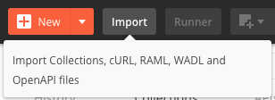
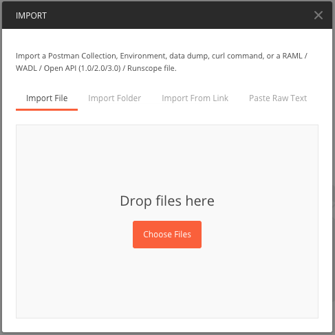
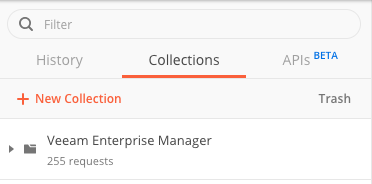

# Postman for Enterprise Manager (EM)

[Postman](https://www.getpostman.com/) is a tool that’s build by developers for developers. It provides a complete API development environment with stream-lined collaboration to help any number of use cases including testing, development, & product development. They do have both [free and paid versions](https://www.getpostman.com/pricing) so if you are looking at getting started, they make it easy and you can work your way up.

All REST API calls for [version 1.4](https://helpcenter.veeam.com/docs/backup/rest/em_web_api_versions.html?ver=95u4) have been added to this Postman collection. By using [Postman variables](https://learning.getpostman.com/docs/postman/environments_and_globals/variables/), this collection also allows for automated auth.

## Requirements

* Veeam Backup Enterprise Manager Update 4 _and above_
* [Postman](https://www.getpostman.com/)

## Getting Started

* Clone the repository locally

```text
git clone https://github.com/VeeamHub/veeam-postman.git
```

* Import the Veeam Enterprise Manager Postman Collection into Postman



* Select `Import File` and choose this file: `Veeam_Enterprise_Manager.postman_collection.json`



* Click `Import`
  * **Wait...be patient!**
* Once imported, it will show up in you Postman Collections as shown below:



* Set the following [variables](https://learning.getpostman.com/docs/postman/environments_and_globals/variables/) in Postman:
  * `vem-url`: Base URL of Enterprise Manager server
  * `vem-username`: Username login
  * `vem-password`: Password login

You can now begin using Postman with Enterprise Manager!
