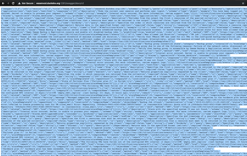
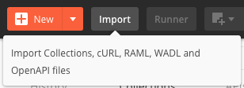

# Postman for Veeam Availability Console (VAC)

[Postman](https://www.getpostman.com/) is a tool that’s build by developers for developers. It provides a complete API development environment with stream-lined collaboration to help any number of use cases including testing, development, & product development. They do have both [free and paid versions](https://www.getpostman.com/pricing) so if you are looking at getting started, they make it easy and you can work your way up.

Importing VAC REST API into Postman was originally mentioned in a [blog post](https://www.cragdoo.co.uk/2017/08/17/veeam-availability-console-api/) by Craig Dalrymple. The method mentioned here not only covers that but automates auth for **all** API calls.

## Requirements

* Veeam Availability Console
  * V3 tested
  * Older versions might work
* [Postman](https://www.getpostman.com/)

## Getting Started

* Get the VAC `swagger.json`
  * To get this, you'll have to navigate to a URL hosted on your VAC server:
    * `https://<vac_web_server>:1281/swagger/docs/v2`
  * Copy **all** of the code on the browser window that comes up

* Import the Veeam Availability Console Collection into Postman

* Select `Import Raw Text` and paste what you copied from your browser

* Click `Import`
  * **Wait...be patient!**
* Once imported, it will show up in you Postman Collections as shown below:

* Set the following [variables](https://learning.getpostman.com/docs/postman/environments_and_globals/variables/) in Postman:
  * `baseUrl`: Base URL of Veeam Availability Console web server
  * `vac-username`: Username login
  * `vac-password`: Password login

* Open the newly imported collection and navigate to the `Accounts Get Token` API call
* Click on the `Body` tab
* Update fields as shown below:

* Click on the `Tests` tab
* Copy/Paste the code from [here](automated_auth_test.js) in this section

* Click `Save`
* Edit the root folder of the collection

* Navigate to the `Authorization` tab
* Choose _Type:_ `Bearer Token`
* Enter for _Token:_ `{{vac_access_token}}`
* Click `Update`

At this point, you've now automated auth for **all** API calls! All you have to do when using an API call in this collection is make sure that `Authorization` is set to _Type:_ `Inherit auth from parent`

You can now begin using Postman with Veeam Availability Console!
