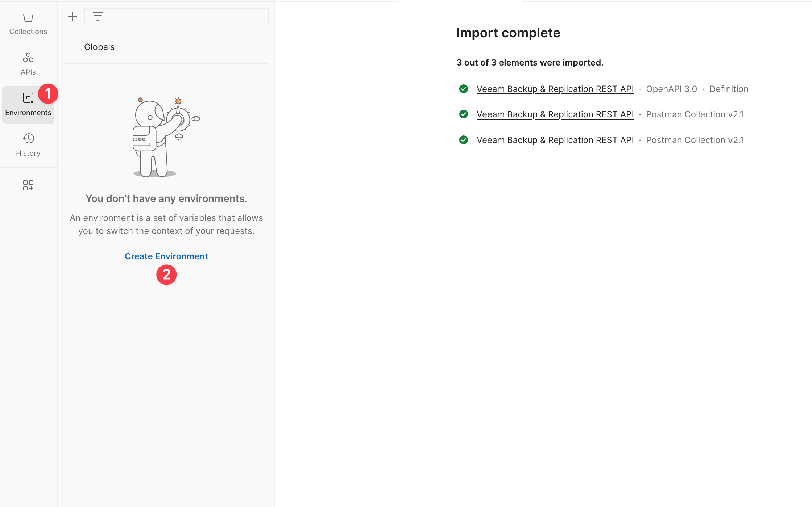

# Postman for Veeam Backup & Replication (VBR)

[Postman](https://www.postman.com/) is an API platform for building and using APIs. There are both free and paid plans available which are detailed on their [pricing](https://www.postman.com/pricing/) page.

## Requirements

* Veeam Backup & Replication v12
* [Postman](https://www.postman.com/)

## Getting Started

1. Obtain the VBR REST API specification.

   

   * The REST API specification is defined and described in a single document that uses and conforms to the [OpenAPI 3.0 specification](https://swagger.io/specification/v3/).
  
   * The VBR server hosts a Swagger UI where you can browse the API and try it out. More details are available in the [Veeam Backup & Replication REST API Reference Guide](https://helpcenter.veeam.com/docs/backup/vbr_rest/evaluation_swagger_ui.html).
  
   * You can download a `swagger.json` file from your VBR server that contains the REST API specification at the following address by default:

   * `https://<vbr_server_ip_address>:9419/swagger/v1.1-rev0/swagger.json`

   * `v1.1-rev0` is the latest API version and revision that was released with Veeam Backup & Replication v12. More details are available on the [Versioning](https://helpcenter.veeam.com/docs/backup/vbr_rest/versioning.html) page of the REST API Reference Guide.

1. Import the `swagger.json` file as a Postman Collection.

   

   

   * _Wait a few moments while the API is imported._

   * The API will be imported as a collection.

   

1. Create an environment to store [variables](https://learning.postman.com/docs/sending-requests/variables/).

   

   * Select `Environments` on the left, then `Create Environment`.

   

   * Give the environment a name, e.g., `VBR 12`.

   * Add the following variables:

     * `baseUrl`: Base URL of Veeam Backup & Replication REST API

       * You must include `https://` at the beginning of the URL and `:9419` at the end of the URL

     * `vbr-username`: Username to authenticate with the VBR server

     * `vbr-password`: Password to authenticate with the VBR server

       * For the password variable, set the Type to `secret` to hide it

   * Select `Save` to save the environment and variables.

1. Set up authorization for the collection.

   

   * Switch to the Collections view.

   * Select the root folder of the `Veeam Backup & Replication REST API` collection.

   * Select the `Authorization` tab.

   * In the `Type` dropdown menu, select `Bearer Token`.

   * In the `Token` field, add `{{vbr_access_token}}`.

   * In the top right of the window, select the `VBR 12` environment.

   * Select `Save`.

1. Configure `Authorization` for the `Get Access Token` API call.

   

   * Expand the collection to `api/v1/oauth2/token` and select the `Get Access Token` API call.

   * Select the `Authorization` tab.

   * In the `Type` dropdown menu, select `No Auth`.

1. Configure `Body` for the `Get Access Token` API call.

   

   * Select the `Body` tab.

   * Set the fields as follows:

     * `grant_type` : `password`

     * `username` : `{{vbr-username}}`

     * `password` : `{{vbr-password}}`

     * Disable / uncheck the others

1. Configure `Tests` for the `Get Access Token` API call.

   

   * Select the `Tests` tab.

   * Copy & paste the code from the [automated_auth_test.js](automated_auth_test.js) file.

   * Select `Save` to save your changes to the API call.

1. Select `Send` on the `Get Access Token` API call to authenticate.

   * You have authenticated with the VBR REST API and are now ready to start using other methods!

All you have to do when using an API call in this collection is make sure that the authorization type is set to `Inherit auth from parent`.

